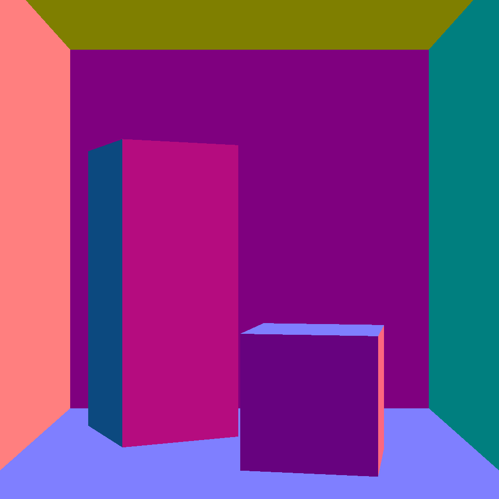
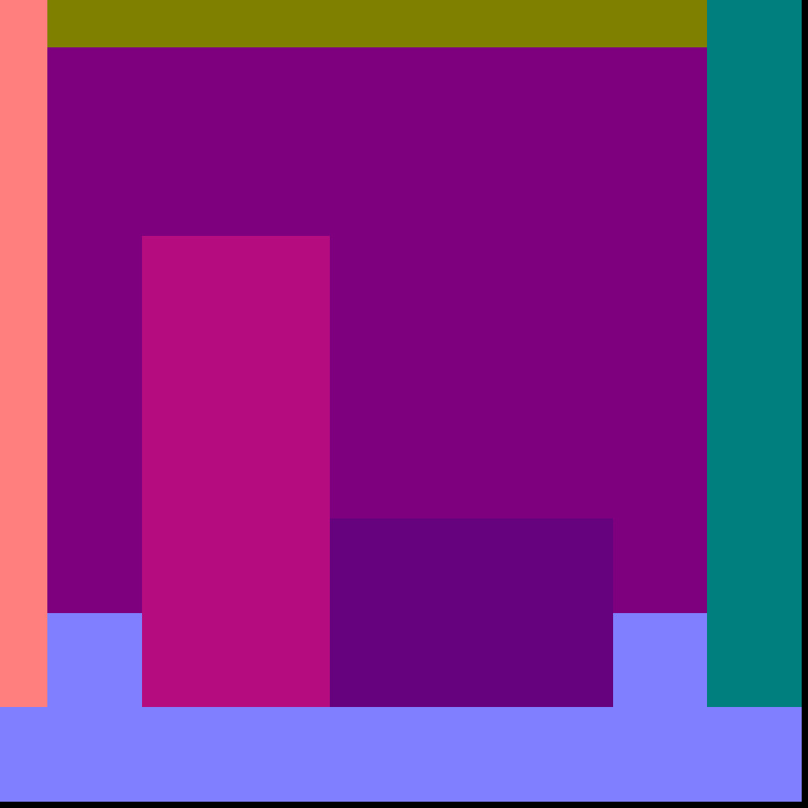
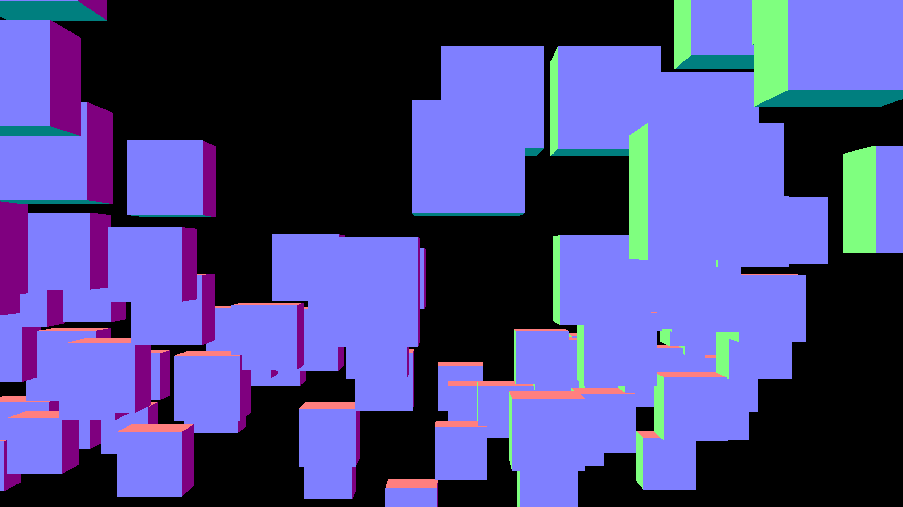

# Assignment Report

## Computer Graphics
- **Name:** Prakhar Singhal
- **Roll Number:** 2022111025

---

## 1. Question-1: Floating Point Precision Error and Solution

### 1.1 Problem Description
When translating the same scene by 10^6 blocks, the rendered image turned out to be 2-D instead of the expected 3-D rendering. The issue stemmed from a floating-point precision error in a bottleneck equation. The error occurred during the subtraction of the upper-left vector of the camera from the pixel center to obtain relative coordinates of the pixel in the pixel array.

### 1.2 Solution Implemented
The solution was two-fold:
1. **Precision Limit:** Identified the bottleneck equation and applied a precision limit to significantly reduce floating-point precision errors.
2. **Use of Double Data Type:** Utilized the `double` data type, which is more informative and led to a substantial improvement in render quality.

### 1.3 Visual Representation
#### Correct Image


#### Incorrect Image


#### Solution Image


---

## 2. Question 2: Accelerating Rendering Process

### 2.1 Axis Aligned Bounding Box (AABB)
An Axis Aligned Bounding Box is a simple bounding volume that encloses an object, aligned with the coordinate axes. This accelerates the rendering process through a slab test, quickly eliminating unnecessary calculations for objects outside the bounding box.

#### AABB Slab Test Pseudocode
```plaintext
function AABB_SlabTest(ray, bounding_box):
    tmin = (bounding_box.min - ray.origin) / ray.direction
    tmax = (bounding_box.max - ray.origin) / ray.direction
    
    tmin, tmax = min(tmin, tmax), max(tmin, tmax)
    
    if tmax < 0:
        return false  // Ray is intersecting behind the bounding box
    
    if tmin > tmax:
        return false  // No intersection
    
    return true  // Intersection detected
```

### 2.2 Bounding Volume Hierarchy (BVH) - Longest Axis Divide
An essential component of the rendering process is the Bounding Volume Hierarchy (BVH), particularly the longest axis divide technique. The following pseudocode illustrates the BVH construction based on the longest axis divide:

```plaintext
function BuildBVH(objects):
    if len(objects) == 1:
        return create_leaf_node(objects[0])

    split_axis = find_longest_axis(objects)
    left_objects, right_objects = split_objects(objects, split_axis)

    left_node = BuildBVH(left_objects)
    right_node = BuildBVH(right_objects)

    return create_internal_node(split_axis, left_node, right_node)
```

### 2.3 Two-Level BVH
A two-level BVH involves one BVH on surfaces and another on triangles, built according to a longest axis split binary tree. Each leaf node contains a limited number of triangles (e.g., 3), making rendering less memory-intensive without sacrificing performance.

---

## 3. Rendering Approaches and Time Analysis

### Time Taken by Different Rendering Approaches

| Rendering Approach    | Time Taken (ms) |
|-----------------------|-----------------|
| Naive                 | [191032.000]    |
| AABB                  | [17018.408]     |
| BVH on AABB           | [17071.416]     |
| Two Level BVH         | [5591.312]      |

---

* Times are for scene_hi_poly.json in Question_2/Cornell_Box directory

* Times for plain AABB slab test acceleration and BVH on Surface are almost same due to number of objects in scene being sparse.

For Demonstration Purpose I have included a test file in Assingment 1 directory named Test_Multi_Obj which contains 1000 objects and the time taken by different rendering approaches are as follows:

#### Test Image


#### Time Taken by Different Rendering Approaches
| Rendering Approach    | Time Taken (ms) |
|-----------------------|-----------------|
| Naive                 | [653737.875]    |
| AABB                  | [20057.439]     |
| BVH on AABB           | [7845.752]      |
| Two Level BVH         | [7708.137]      |

